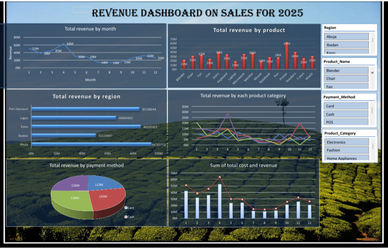

# Revenue Dashboard – Sales 2025 | Excel

**Tools Used**: Pivot Tables, Pivot Charts, Slicers, Power Query, Combo Charts

### **Business Questions Answered**
1. Which months drove the highest revenue in 2025?
2. What products and regions are most profitable?
3. How do payment methods impact sales?
4. What’s the relationship between cost and revenue?

### **Key Insights**
- **Peak Revenue**: Month 3 hit 64M, lowest in Month 7-9 at 14M
- **Top Region**: Abuja at 94.7M, followed by Kano at 86.3M  
- **Best Product**: Printer at 63M revenue
- **Payment Split**: Cash 132M vs Card 113M vs POS 126M vs Other 138M
- **Cost vs Revenue**: Revenue consistently above cost, healthy margins

### **Dashboard Preview**

### **Technical Skills Demonstrated**
- Data modeling with Pivot Tables
- Interactive analysis using Slicers for Region, Product, Payment Method
- Visual storytelling: Line, bar, column, pie, and combo charts
- KPI tracking: Monthly trends, regional performance, product breakdown
- Cost vs Revenue analysis with combo chart

### **Data Source**
Anonymized sales transaction data for 2025
